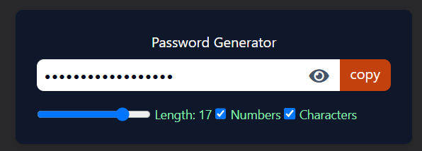
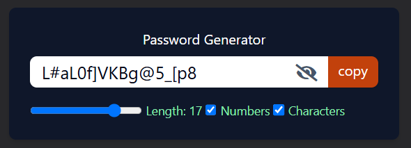

# react-concepts

 ## [1] React Router
 


<details>
<summary>React Router Installation</summary>

```javascript
    npm install react-router-dom
```
</details>


<details>
<summary>Link and NavLink In React Router</summary>

- In the header component, import the react-router-dom

```javascript
import { Link, NavLink } from 'react-router-dom';
```
- The anchor tag or ```<a>``` tag is not used in React as it refreshes the whole page which is not the concept of react, that's why ```Link``` tag is used in react which is imported from ```react-router-dom```.

```javascript
<Link to="/" className="flex items-center">
    Home
</Link>
```


- When we use ```NavLink``` we have a variable named ```isActive``` which can be used for changing the appearance of the link on active page when it is in active state. It macthes the state with the URL.

```javascript
<li>
    <NavLink
        to="/about"
        className={({isActive}) =>
            `block py-2 pr-4 pl-3
            ${isActive ? "text-purple-400" : "text-gray-600"}

            duration-200 
            border-b border-gray-100 hover:bg-gray-50 
            lg:hover:bg-transparent 
            lg:border-0 hover:text-purple-400 lg:p-0`
        }
    >
        About
    </NavLink>
</li>

```
</details>


<details>
<summary>React Outlet</summary>

- ```Outlet``` is provided by react-router-dom that will be changed but its upper and lower items like Header and Footter will remains same.

- To change the components between header and footer, we need to import ```Outlet``` from react-router-dom in the file Layout.jsx.

```javascript
    import { Outlet } from 'react-router-dom'
```

- Then, do the following: 

```javascript
function Layout() {
  return (
    <>
        <Header />
        <Outlet />
        <Footer />
    </>
  )
}
```

</details>


<details>
<summary>React Router Configuration</summary>

- import the following:

```javascript
import { RouterProvider, createHashRouter,createBrowserRouter, createRoutesFromElements, Route } from 'react-router-dom'   
```

- In the main.js, pass the router prop in the ```RouterProvider```

```javascript
createRoot(document.getElementById('root')).render(
  <StrictMode>
    <RouterProvider router={router} />
  </StrictMode>,
)    
```
- We can create router in two different ways.

- We have ```createBrowserRouter``` method which will take an array of objects that contains path, element, and children.

- This is Metnod -1

```javascript
// create a router METHOD 1
const router = createBrowserRouter([
  {
    path: '/',
    element: <Layout />,
    children: [
      {
        path: "",
        element: <Home />
      },
      {
        path: "about",
        element: <About />
      },
      {
        path: "/contact",
        element: <Contact />
      }
    ]
  }
])
)    
```

- This is Method -2
- Instead of passing an array of objects, we can also call a method inside the ```createRoutesFromElements``` method.

```javascript
//create a rouyer METHOD 2
const router = createHashRouter(
  createRoutesFromElements(
    <Route path='/' element={<Layout />}>
      <Route path='' element={<Home />} />
      <Route path='about' element={<About />} />
      <Route path='contact' element={<Contact />} />
      <Route path="user" element={<User />} />
      <Route path="user/:userid" element={<User />} />
      <Route
        loader={githubLoader} 
        path="github" 
        element={<Github />} />
    </Route>
  )
)
```

- Here, the ```createHashRouter``` is used for githib pages instead of ```createBrowserRouter```. We need to use this whenever we want to deploy it as a github page.

</details>


<details>
<summary>Optimzed version of fetching data without useEffect Hook </summary>

- Create a async method that will return the response in JSON format.
```javascript
export const githubLoader = async () => {
    const response = await fetch('https://api.github.com/users/Razi-Azam')
    return response.json()
}
```
- To get the data returned by "githubLoader" function, we have to import "useLoaderData".
```javascript
import { useLoaderData } from 'react-router-dom';
```
- use the data with the help of useLoaderData as follows:
```javascript
function Github() {
    const userData = useLoaderData()


  return (
    <div className='flex flex-row justify-center items-center p-4'>
        <div>
            
        </div>
    </div>
  )
}
```
</details>


 ## [2] useEffect, useRef and useCallback
- Added an eye icon to toggle password visibility.





<details>
<summary>Create cached form of password generator function using useCallback hook </summary>

```javaScript
  const generatePassword = useCallback(() => {
    let pass = " "
    let str = "ABCDEFGHIJKLMNOPQRSTUVWXYZabcdefghijklmnopqrstuvwxyz"

    if(allowNumber) str += "0123456789"
    if(allowCharacter) str += "~`!@#$%^&*-+_{}[]()"

    for(let i = 1; i <= passlength; i++) {
      let char = Math.floor(Math.random() * str.length + 1 )
      pass += str.charAt(char)
    }

    setPassword(pass)

  }, [setPassword, passlength, allowNumber, allowCharacter])
```

</details>

<details>
<summary>Copy Button</summary>

```javaScript
  const copyPasswordBtn = useCallback(() => {

    //auto select the password when the copy button is clicked
    passwordRef.current?.select()

    //to select values only a specific range.
    //this will highlight only first 8 password
    passwordRef.current?.setSelectionRange(0, 8)
    
    window.navigator.clipboard.writeText(password)
  }, [password])
```
</details>


<details>
<summary>Toggle Eye Button</summary>

```javaScript
  const togglePassword = () => {
      setIsPasswordAppear(!isPasswordAppear)
  }
```
</details>


<details>
<summary>Call generatePassword() inside useEffect hook</summary>

```javaScript
    useEffect(() => {
    generatePassword()
  }, [passlength, allowNumber, allowCharacter, generatePassword])
```
</details>


### useEffect
- ```useEffect``` is used to perform side effects in functional components.
- Side effects can include tasks like fetching data, subscribing to external data sources, directly manipulating the DOM, and cleaning up resources.

**When to Use:**
- When you need to perform an action after the component has rendered (e.g., fetching data, setting up subscriptions).
- When you need to clean up resources before the component unmounts or updates (e.g., removing event listeners).

**Alternatives:**
- useLayoutEffect: If the effect needs to run synchronously after all DOM mutations (e.g., reading from the DOM and synchronously re-rendering), you can use useLayoutEffect instead of useEffect.


### useRef
- ```useRef``` creates a mutable object which persists across renders. It's primarily used for accessing DOM elements or storing a value that doesn’t trigger a re-render when updated.

**When to Use:**
- When you need to store a reference to a DOM element (e.g., focus an input field).
- When you need to store a mutable value that doesn’t cause a re-render when updated (e.g., holding a previous value for comparison).


**Alternatives:**
- useState: If you need to track state and trigger a re-render when the value changes, use useState instead of useRef.
- Refs in Class Components: In class components, you would use React.createRef() for DOM references.


### useCallback
- ```useCallback``` returns a memoized version of a callback function. It’s useful when passing functions as props to child components, preventing unnecessary re-renders due to function reference changes.

**When to Use:**
- When you want to avoid re-creating the same function on every render (especially in performance-sensitive applications).
- Useful when the function is passed as a prop to child components to prevent unnecessary re-renders.


### Comparison Table

| Hook          | Purpose                                                         | When to Use                                                             | Alternatives                                                     |
|---------------|-----------------------------------------------------------------|------------------------------------------------------------------------|------------------------------------------------------------------|
| `useEffect`   | Side effects (e.g., fetching data, subscribing, cleaning up)   | When you need to perform side effects after render or on updates        | Lifecycle methods in class components, `useLayoutEffect` for synchronous DOM updates |
| `useRef`      | Access DOM elements and persist values across renders           | When you need a persistent reference to a DOM element or mutable value | `createRef` in class components, `useState` for state tracking  |
| `useCallback` | Memoize functions to prevent unnecessary re-renders             | When you pass functions as props to children and want to avoid re-renders | `useEffect` in some cases, memoizing in parent component directly |
